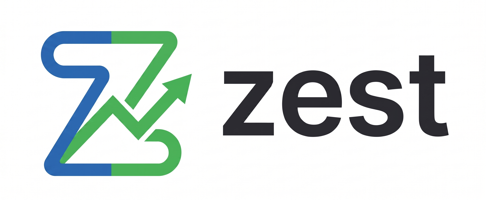

<p align="center">
  
</p>

<h1 align="center">Zest Trading Platform</h1>

<p align="center">
  A full-stack, simulated stock trading platform built for the Indian market.
  <br/>
  Manage your virtual portfolio, track watchlist data, and place instant paper trades.
</p>

<p align="center">
  
  
  
  
</p>

---

## What is Zest?

Zest is a paper-trading web application that simulates the experience of a real Indian brokerage platform. Users can sign up, get a virtual funded account, and place buy/sell orders on NSE-listed stocks. It supports both CNC (delivery) and MIS (intraday) product types, a live TradingView chart on the dashboard, and a full fund management system with deposit and withdrawal simulation.

> **Note:** This is a simulated platform. No real money or real trades are involved.

---

## Tech Stack

| Layer     | Technology                                      |
|-----------|-------------------------------------------------|
| Frontend  | React 19, Vite, React Router v7, Axios, MUI, Tailwind CSS |
| Backend   | Node.js, Express 5, JWT (cookie-based auth), bcrypt |
| Database  | MongoDB with Mongoose ODM                       |

---

## Features

- **Authentication** — Secure signup/login with JWT stored in HTTP cookies
- **Dashboard** — Live NIFTY chart powered by TradingView widget
- **Watchlist** — Track NSE stocks with price and percentage change
- **Holdings** — View long-term CNC positions with P&L and average price
- **Positions** — View intraday MIS trades including short positions
- **Orders** — Full order history with BUY/SELL log
- **Funds** — Add/withdraw virtual funds, view transaction history, reset account
- **Dark Mode** — Full dark/light theme toggle across the dashboard
- **Protected Routes** — Dashboard inaccessible without a valid session

---

## Project Structure

```
ZestTrading/
├── frontend/        # React + Vite client application
├── backend/         # Node.js + Express API server
├── .gitignore
└── README.md
```

---

## Running Locally

### Prerequisites

- Node.js v18 or higher
- A MongoDB instance (local or [MongoDB Atlas](https://www.mongodb.com/atlas))

### Steps

1. **Clone the repository**
   ```bash
   git clone https://github.com/dotrwt/ZestTrading.git
   cd ZestTrading
   ```

2. **Start the backend** — see [backend/README.md](./backend/README.md)

3. **Start the frontend** — see [frontend/README.md](./frontend/README.md)

Both servers need to be running simultaneously for the app to work.

---

## Screenshots

> *(Add screenshots or a demo GIF of the dashboard, order window, and authentication screens here)*

---

## Contributing

Pull requests are welcome. For major changes, please open an issue first to discuss what you would like to change.

## License

[MIT](https://choosealicense.com/licenses/mit/)
